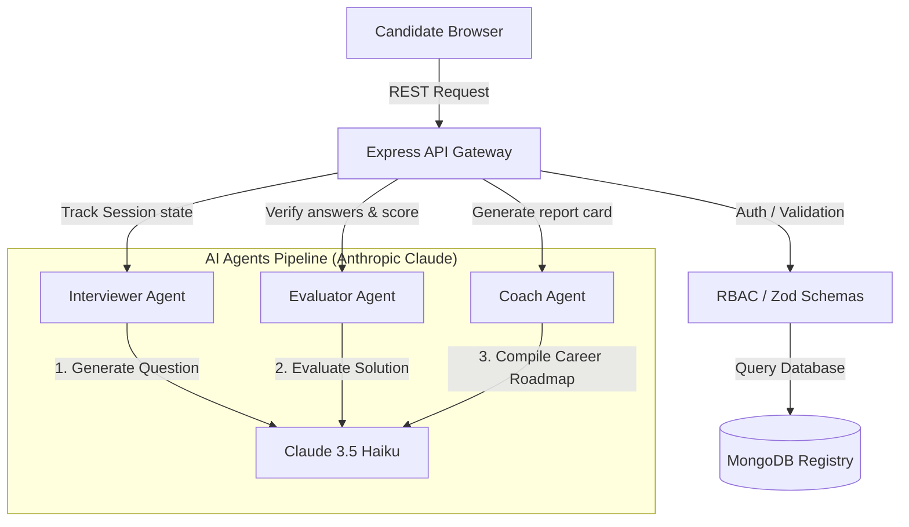

# AI-Powered DevOps Technical Interview Platform

A production-grade, multi-agent AI evaluation platform designed to conduct technical interviews for DevOps candidates. Powered by Claude, the platform dynamically generates topic-specific scenarios, grades answers in real-time, and outlines structured career coaching paths, all within a hardened, containerized architecture.

---

## Architecture Overview

The system orchestrates three specialized AI agents (Interviewer, Evaluator, and Coach) using Anthropic Claude to drive the interview lifecycle:



1. **Interviewer Agent**: Plays the persona of a Senior DevOps Interviewer. Receives the topic, difficulty level, and list of previous questions, generating unique, depth-appropriate scenario challenges.
2. **Evaluator Agent**: Evaluates user answers against a reference answer and expected key points, returning marks (0-10), covered points, missed points, and technical explanations.
3. **Coach Agent**: Triggers upon session completion, digesting the entire Q&A history to formulate professional development feedback, strengths, weak areas, next steps, and recommended resources.

---

## 🌟 Full Feature List

* **Multi-Role User Portals**:
  * **Candidate**: Configuration dashboard, interactive interview rooms, progress indicators, real-time score verdicts, and career roadmaps.
  * **Recruiter**: Candidate directory containing user summaries, session history, and drill-down scores.
  * **Admin**: Aggregated charts tracking scoring averages by topic, difficulty level distributions, most commonly missed concepts, and platform utilization timelines.
* **Granular Role-Based Access Control (RBAC)**: Custom JWT verification layers blocking unauthorized cross-role API requests.
* **Production Security Hardening**: Zod schema validation, Helmet.js headers protection, custom LLM prompt injection sanitizers, and request correlation tracing.
* **Kubernetes Orchestration**: Persistent StatefulSets for databases, Horizontal Pod Autoscalers (HPA) for backend workloads, and Ingress routing rules.
* **Observability Exporters**: Custom `/api/metrics` Prometheus metrics exporter mapping API latency, Claude latencies, active sessions, and status code rates.

---

## 🛠️ Technology Stack

* **Frontend**: React 19, TypeScript, Axios, React Router, Recharts, CSS3 Custom Properties.
* **Backend**: Node.js, Express, TypeScript, Mongoose, JWT, Zod, Morgan, Helmet.
* **Database**: MongoDB (Local or hosted Atlas).
* **AI Engine**: Anthropic SDK (Claude 3.5 Haiku).
* **Telemetry**: Prom-client, Prometheus Operator, Grafana.
* **Orchestration**: Docker, Docker Compose, Kubernetes.

---

## 🚀 Setup Instructions

### 1. Local Manual Development
1. **Prerequisites**: Verify that MongoDB is running on your host system.
2. **Clone & Install**:
   ```bash
   # Install dependencies in both environments
   npm install --prefix backend --legacy-peer-deps
   npm install --prefix frontend
   ```
3. **Configure Environment**:
   Create a `backend/.env` file with:
   ```env
   PORT=5000
   MONGO_URI=mongodb://localhost:27017/ai-devops-interview
   JWT_SECRET=your_production_jwt_secret_key_32_chars_long
   ANTHROPIC_API_KEY=your-actual-claude-api-key-here
   ```
4. **Boot Up Services**:
   ```bash
   # Start backend (Terminals 1)
   cd backend && npm run dev
   # Start frontend (Terminals 2)
   cd frontend && npm run dev
   ```
5. **Run Integration Tests**:
   ```bash
   cd backend && npm test
   ```

### 2. Local Containerized Setup (Docker Compose)
To run the database, API, and client services inside networked Docker containers:
```bash
docker-compose up --build
```
* **Frontend**: http://localhost:8080
* **Backend**: http://localhost:5000
* **MongoDB**: localhost:27017

### 3. Production Kubernetes Deployment
1. **Namespace Isolation**:
   ```bash
   kubectl apply -f infra/k8s/namespace.yaml
   ```
2. **Configure Secrets**:
   Copy the secrets template (`cp infra/k8s/secret.yaml.example infra/k8s/secret.yaml`), insert your base64 credentials, and apply:
   ```bash
   kubectl apply -f infra/k8s/secret.yaml
   ```
3. **Deploy manifests**:
   ```bash
   kubectl apply -f infra/k8s/
   ```
4. **Verify rollout status**:
   ```bash
   kubectl rollout status deployment/backend-deployment -n devops-platform
   ```

---

## 🎯 Why This Project is Different

This platform is not a simple wrapper around a chatbot. It represents a production-ready DevOps implementation:

### 1. Robust Multi-Agent Pipeline
The interview is divided into discrete, specialized agent modules. By dividing Interviewing, Evaluation, and Coaching into separate, system-prompted LLM runs, we ensure that:
* Candidates never see reference answers during tests.
* Grading is strict, consistent, and structured.
* Career coaching stays highly actionable rather than generic.

### 2. Tailored Difficulty Guidelines
Unlike platforms that adjust difficulty dynamically (often causing erratic session behaviors), this platform locks difficulty levels based on the user's initial selection:
* **Easy**: Focuses on core definitions and baseline command syntaxes.
* **Medium**: Examines scenario solutions ("How would you achieve X under Y constraints?").
* **Hard**: Deep dives into systems design, failover engineering, and trade-off architectures.

### 3. Kubernetes Native Design
The system's infrastructure manifests model production best practices:
* StatefulSet database workloads with persistent volume claims (PVC) to guarantee data safety.
* Horizontal Pod Autoscaling (HPA) to scale pods based on traffic load.
* Ingress reverse proxying to route client and API proxy traffic.

### 4. Telemetry Observability
The application natively tracks operational metrics using `prom-client`. It exposes a `/api/metrics` Prometheus exporter that records metrics like:
* **HTTP Latency**: quantiles mapping average API response latency.
* **Claude Latency**: tracking latency on Claude completions.
* **Error rates**: alerting on 4xx/5xx code spikes.
* **Active sessions**: counting concurrent candidates.
This allows SREs to deploy Grafana dashboards with exact PromQL definitions out-of-the-box.
